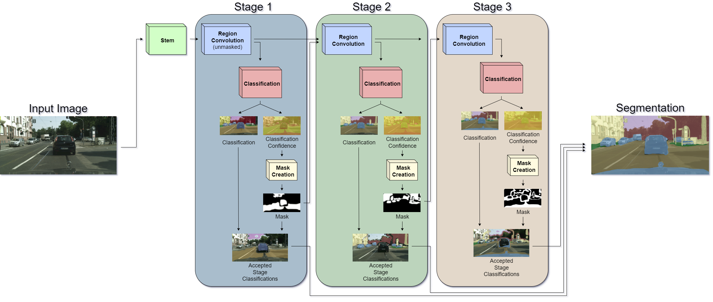

# Semantic Segmentation via Percentile-Based Masking

This repository contains the implementational materials from a MSc graduation project **"Controlling the Balance Between Computational
Cost and Performance of Semantic Segmentation
via Percentile-Based Masking"** by Domantas Giržadas

# Description of The Project
Due to immense computational costs of running image segmentation models, the
field is beginning to pay more and more attention towards computational efficiency.
However, the proposed solutions are mostly generic and context-independent, which
restricts the computational cost savings in high-variability domains, such as autonomous driving. 
Being able to explicitly control the inference process of a deep
learning-based image segmentation architecture has the potential of improving the
performance, computational efficiency and reliability of the model. Therefore, the
purpose of this thesis is to explore a possibility of gaining more control over the semantic segmentation process. 
In pursuit of achieving this ambition, a novel semantic segmentation model architecture has been proposed in this 
thesis. This novel architecture is based on splitting the pixel classification process into stages, where
a newly-introduced hyperparameter _q_ determines whether predictions get accepted
or propagated forward for refinement in each stage. The results, obtained after
training this model, show that deeper stages (stages that make predictions after
more non-linear transformations) make better predictions. Consequently, controlling the number of pixels that get
accepted in each stage via the parameter q makes it possible to explicitly control the balance between computational costs and model
performance during inference. Being able to control this balance, one can define
the behaviour of a semantic segmentation model on a case-by-case basis and obtain
case-specific computational cost benefits that are lost with generic models.

# Description of the Repository
In this repository, you can find:
1. An implementational [definition of the proposed architecture](net.py)
2. Utility functions for [using the architecture](utils.py), [processing cityscapes data](dataset_utils.py) and [visualising the outputs of the network](visual_utils.py)
3. A file, containing the [trained weights](data/net-demo.pt) of the proposed model
4. A brief [demo notebook](Percentile_Masking-Demo.ipynb), which shows how to perform inference on the proposed model and visualis its outpus.